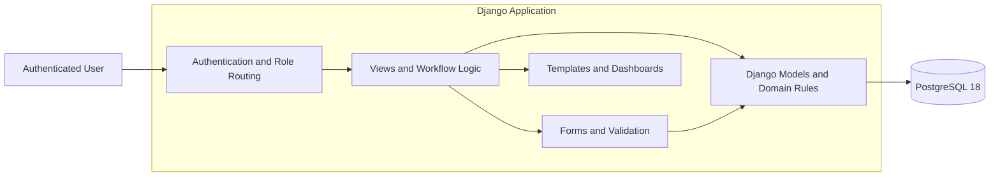
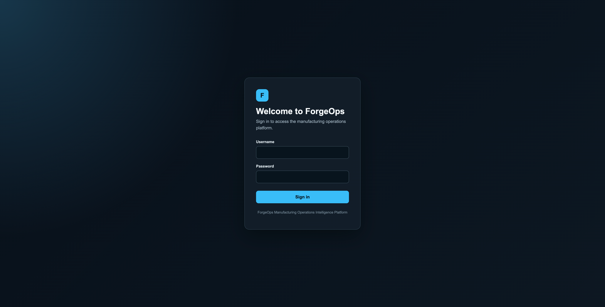
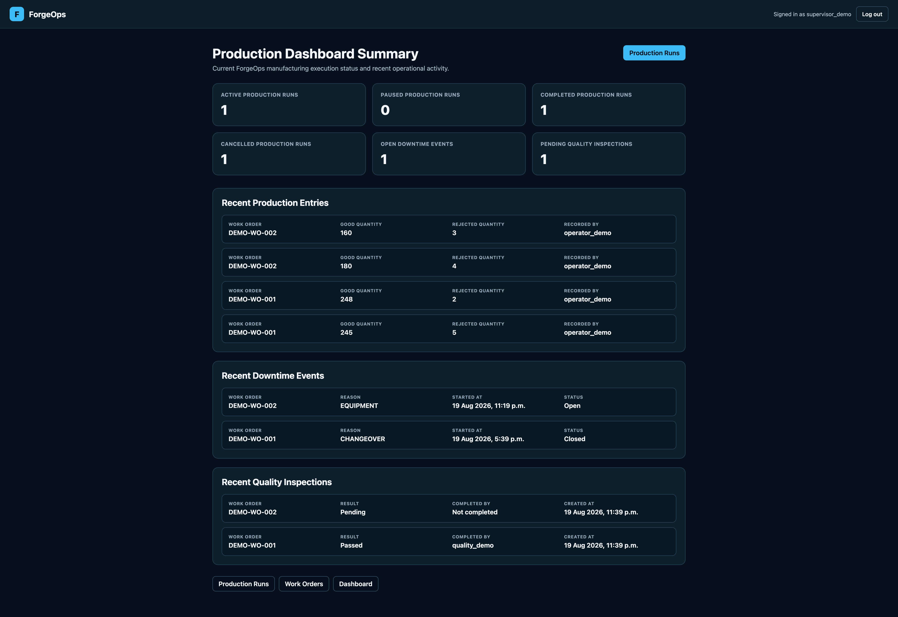
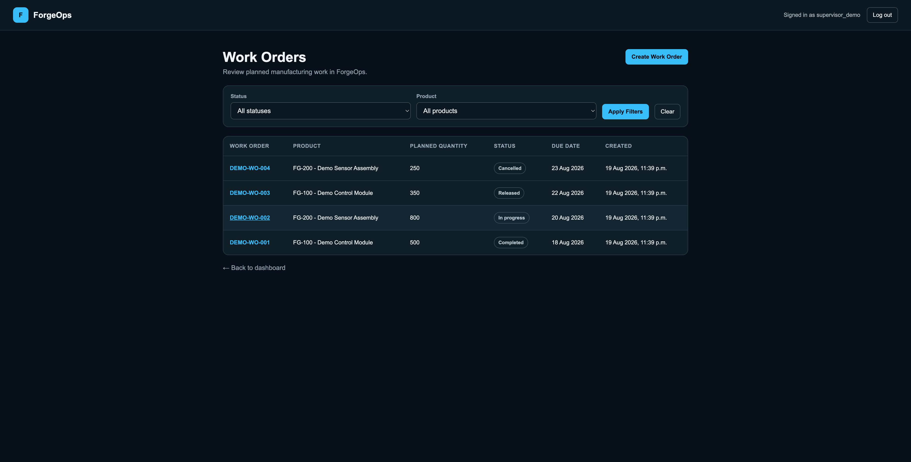
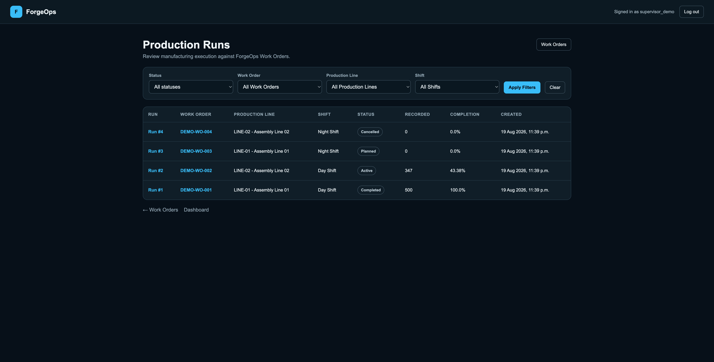
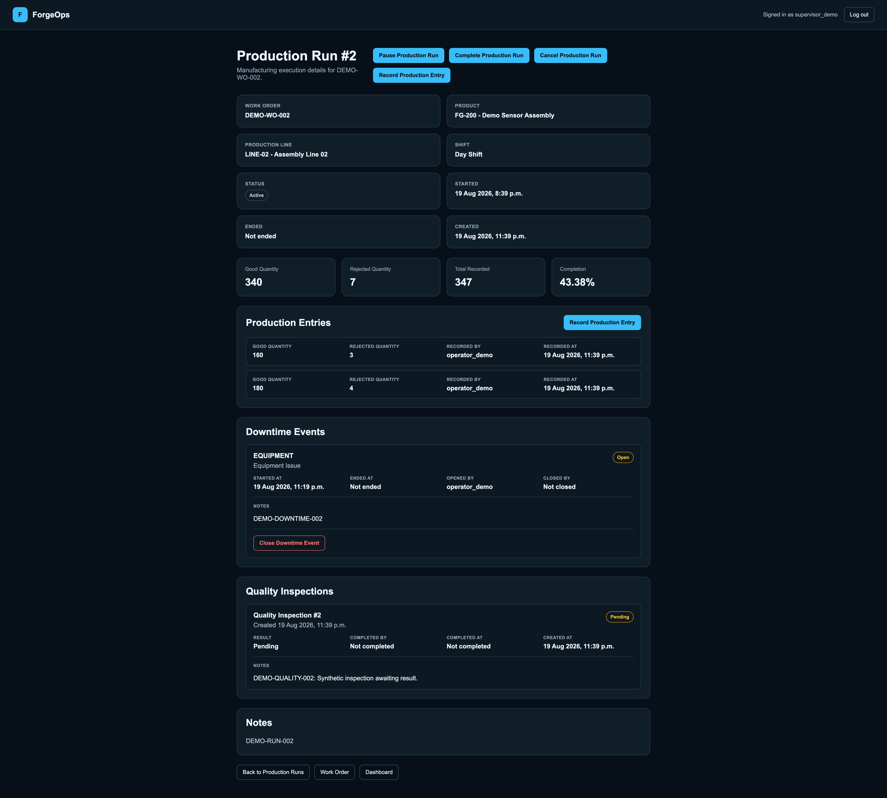
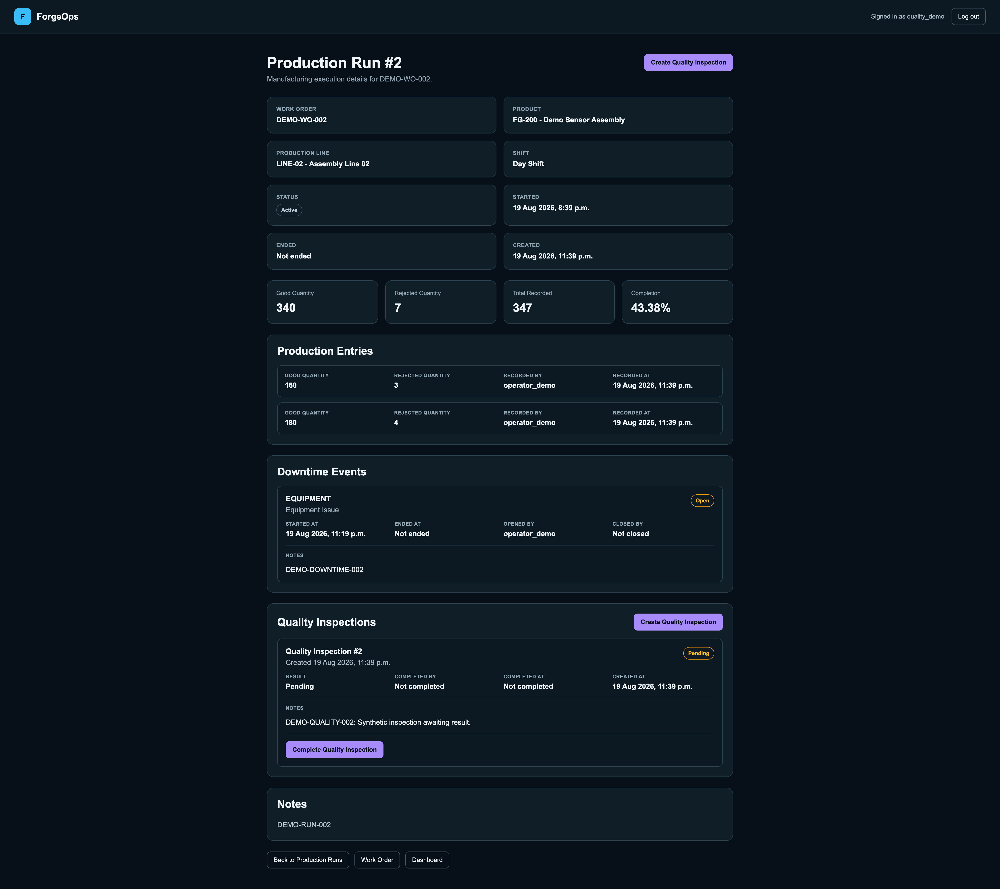
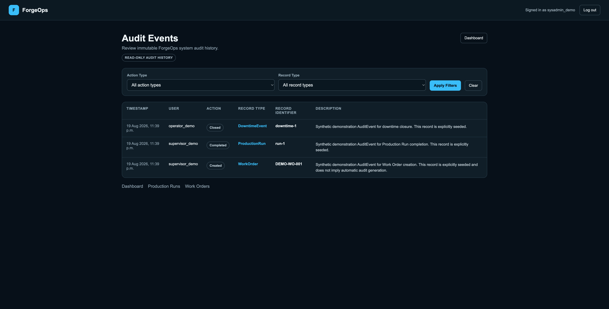

# ForgeOps Manufacturing Operations Platform

ForgeOps is an educational manufacturing operations platform for production tracking, downtime analysis, quality inspections and operational intelligence.

It is a Django and PostgreSQL portfolio project designed to demonstrate manufacturing-domain modelling, role-based operational workflows, data integrity, automated testing, containerised development and continuous integration.

> **Educational project:** ForgeOps is not a validated production MES and does not process real manufacturing data. All test, screenshot and demonstration data must remain synthetic.

## Overview

ForgeOps models a lightweight manufacturing operations environment around the following workflow:

```text
Product
└── Work Order
    └── Production Run
        ├── Production Entries
        ├── Downtime Events
        └── Quality Inspections
```

Production execution is connected to the physical manufacturing hierarchy:

```text
Site
└── Production Area
    └── Production Line
```

The application provides authenticated, role-based access for operational users and management roles.

## Key Features

The ForgeOps MVP currently includes:

- manufacturing hierarchy management
- Product reference data
- Work Order creation
- Production Run creation
- Production Run start, pause, resume, completion and cancellation workflows
- transactional production quantity recording
- good and rejected quantity tracking
- downtime reason configuration
- downtime opening and closing workflows
- Quality Inspection creation and completion
- passed and failed inspection results
- role-specific dashboards
- operational summary metrics
- AuditEvent model and read-only audit-history visibility
- Django authentication
- Django Group-based role permissions
- PostgreSQL database constraints
- Docker and Docker Compose development
- automated regression testing
- GitHub Actions continuous integration
- deterministic synthetic MVP demonstration data

## Technology Stack

| Area | Technology |
| --- | --- |
| Backend | Django 6.0 |
| Language | Python 3.12 |
| Database | PostgreSQL 18 |
| Frontend | Django Templates, HTML, CSS |
| Authentication | Django Authentication |
| Authorisation | Django Groups and server-side permission checks |
| Containers | Docker and Docker Compose |
| Continuous Integration | GitHub Actions |
| Source Control | Git and GitHub |

## Architecture

ForgeOps uses a server-rendered Django architecture.



More detail is available in:

```text
docs/architecture.md
```

## Manufacturing Data Model

The implemented Core models are:

```text
Site
ProductionArea
ProductionLine
Product
Shift
DowntimeReason
WorkOrder
ProductionRun
ProductionEntry
DowntimeEvent
QualityInspection
AuditEvent
```

The complete MVP entity-relationship documentation is available in:

```text
docs/diagrams/er-diagram.md
```

## Production Workflow

The main operational flow is:

```text
Work Order
    ↓
Production Run
    ↓
Start Production
    ↓
Record Production Output
    ↓
Record Downtime when required
    ↓
Record Quality Inspection
    ↓
Complete Production Run
    ↓
Review Operational Metrics
```

Lifecycle actions remain explicit workflows.

For example:

```text
PLANNED -> ACTIVE
ACTIVE  -> PAUSED
PAUSED  -> ACTIVE
ACTIVE  -> COMPLETED
eligible states -> CANCELLED
```

Opening downtime does not automatically pause a Production Run.

Closing downtime does not automatically resume a Production Run.

Quality Inspection results do not automatically change Production Run state.

The complete implemented workflow is documented in:

```text
docs/diagrams/production-workflow.md
```

## Role-Based Access

ForgeOps uses Django Groups to represent application roles.

The current roles are:

| Role | Primary MVP Responsibility |
| --- | --- |
| Operator | Operational production entry and permitted downtime workflows |
| Production Supervisor | Work Orders, Production Runs and lifecycle management |
| Quality Specialist | Quality Inspection workflows |
| Manufacturing Engineer | Engineering-oriented operational visibility |
| Operations Manager | Management dashboard visibility |
| System Administrator | Broad operational administration |

Django superusers retain Django administrative access independently of these application groups.

User-interface controls are not treated as security boundaries.

Protected workflows are also enforced through server-side permission checks.

## Demonstration Users

Synthetic demonstration accounts can be created using:

```bash
python manage.py seed_demo_users
```

For Docker:

```bash
docker compose exec web python manage.py seed_demo_users
```

The command securely asks for one password and creates:

| Username | Role |
| --- | --- |
| `operator_demo` | Operator |
| `supervisor_demo` | Production Supervisor |
| `quality_demo` | Quality Specialist |
| `engineer_demo` | Manufacturing Engineer |
| `manager_demo` | Operations Manager |
| `sysadmin_demo` | System Administrator |

Passwords are entered interactively and are never stored in the repository.

## Authentication Routes

```text
/accounts/login/    ForgeOps login page
/accounts/logout/   Logout endpoint
/                   Redirects authenticated users to their assigned dashboard
/admin/             Django administration
```

Users cannot access dashboards belonging to other application roles unless separately authorised.

## Production Quantities

Production quantities are transactional.

ForgeOps stores quantity records using `ProductionEntry` rather than maintaining directly editable cumulative totals on `ProductionRun`.

Each entry records:

```text
good_quantity
rejected_quantity
recorded_by
recorded_at
notes
```

Production Run metrics are derived from these records.

Derived values include:

```text
good quantity
rejected quantity
total recorded quantity
remaining quantity
completion percentage
rejection rate
```

Production Entries can only be created against an `ACTIVE` Production Run.

## Downtime Tracking

Downtime is represented using `DowntimeEvent`.

Each event records:

```text
Production Run
Downtime Reason
start time
end time
opened by
closed by
notes
```

Only one Downtime Event may remain open for the same Production Run at a time.

Downtime duration is derived from its timestamps.

Downtime lifecycle and Production Run lifecycle remain separate workflows.

## Quality Inspections

Quality Inspection results are:

```text
PENDING
PASSED
FAILED
```

Pending inspections have no completion user or timestamp.

Passed and failed inspections require both.

Quality results remain visible as historical operational records.

## Audit Events

ForgeOps contains an `AuditEvent` model and controlled read-only website visibility for authorised users.

AuditEvent stores:

```text
user
action_type
record_type
record_identifier
description
created_at
```

Automatic AuditEvent generation across all operational workflows is **not currently implemented globally**.

ForgeOps therefore does not claim to provide a complete automatic regulatory audit trail.

## Data Integrity

ForgeOps uses both Django validation and PostgreSQL constraints.

Examples include:

- Site codes are unique
- Production Area codes are unique within a Site
- Production Line codes are unique within a Production Area
- Product codes are unique
- Work Order numbers are unique
- Work Order planned quantity must be greater than zero
- Shift start and end times must differ
- Production Run end time cannot precede start time
- only one `ACTIVE` Production Run may exist for a Work Order at a time
- Production Entry quantities cannot be negative
- Production Entries must record at least one unit
- Production Entries require an `ACTIVE` Production Run
- only one Downtime Event may remain open per Production Run
- downtime end time cannot precede downtime start time
- downtime closure requires consistent closing metadata
- Quality Inspection completion metadata must match its result state

Important historical relationships use protected deletion where removing referenced records would damage operational history.

## Screenshots

### Login



### Production Dashboard Summary



### Work Orders



### Production Runs



### Production Run Detail



### Quality Specialist Workflow



### Audit Events



All screenshot data is synthetic and exists only for ForgeOps demonstration purposes.

## Local Development Setup

### Requirements

- Python 3.12+
- PostgreSQL 18
- Postgres.app on macOS, or another compatible local PostgreSQL installation

### Clone and Enter the Repository

```bash
git clone https://github.com/EmirDemirkol/manufacturing-operations-platform.git
cd manufacturing-operations-platform
```

### Create a Virtual Environment

```bash
python3 -m venv .venv
source .venv/bin/activate
```

### Install Dependencies

```bash
pip install -r requirements.txt
```

### Create Local Environment Configuration

```bash
cp .env.example .env
```

Update `.env` with private local development values.

Example variable names:

```text
DJANGO_SECRET_KEY
DB_NAME
DB_USER
DB_PASSWORD
DB_HOST
DB_PORT
```

Do not commit the real `.env` file.

### Apply Migrations

```bash
python manage.py migrate
```

### Create Demonstration Users

```bash
python manage.py seed_demo_users
```

The command securely prompts for one password and creates or updates the six synthetic demonstration accounts.

### Create Demonstration Data

After the demonstration users exist, populate ForgeOps with the deterministic synthetic MVP dataset:

```bash
python manage.py seed_demo_data
```

The command creates or updates synthetic demonstration records including:

```text
Site
Production Area
Production Lines
Products
Shifts
Downtime Reasons
Work Orders
Production Runs
Production Entries
Downtime Events
Quality Inspections
Audit Events
```

The demonstration dataset is idempotent, so rerunning the command updates or reuses the same `DEMO-*` records instead of intentionally creating duplicate demonstration records.

All demonstration records are synthetic.

### Start ForgeOps

```bash
python manage.py runserver
```

The local development application is then available at:

```text
http://127.0.0.1:8000/
```

## Docker Development Setup

ForgeOps can also run using Docker and Docker Compose.

The Docker development architecture contains:

```text
web -> Django
db  -> PostgreSQL 18
```

### Requirements

- Docker Desktop
- Docker Compose

Verify Docker:

```bash
docker --version
docker compose version
```

### Build the Application Image

```bash
docker compose build
```

### Start ForgeOps

```bash
docker compose up
```

Or run in the background:

```bash
docker compose up -d
```

Docker Compose waits for PostgreSQL to become healthy before starting Django.

ForgeOps is available at:

```text
http://127.0.0.1:8000/
```

### Apply Docker Database Migrations

```bash
docker compose exec web python manage.py migrate
```

### Create Docker Demonstration Users

```bash
docker compose exec web python manage.py seed_demo_users
```

### Create Docker Demonstration Data

```bash
docker compose exec web python manage.py seed_demo_data
```

Run the demonstration-user command before the demonstration-data command.

### Run Django System Checks

```bash
docker compose exec web python manage.py check
```

### Check for Migration Drift

```bash
docker compose exec web python manage.py makemigrations --check --dry-run
```

### Run the Core Automated Test Suite

```bash
docker compose exec web python manage.py test core -v 2
```

The verified Docker regression baseline is:

```text
Ran 330 tests
OK
```

### Stop ForgeOps

```bash
docker compose down
```

The PostgreSQL database is stored in the named Docker volume:

```text
manufacturing-operations-platform_postgres_data
```

Normal `docker compose down` preserves the database volume.

To intentionally remove the Docker PostgreSQL data:

```bash
docker compose down -v
```

Use the `-v` form only when intentionally resetting the Docker development database.

## Testing

ForgeOps contains an extensive automated Core regression suite.

Run locally:

```bash
python manage.py test core -v 2
```

Run inside Docker:

```bash
docker compose exec web python manage.py test core -v 2
```

The current verified regression baseline is:

```text
Ran 330 tests
OK
```

The automated tests cover areas including:

- model validation
- database constraints
- authentication
- role permissions
- Work Order workflows
- Production Run creation
- Production Run lifecycle transitions
- Production Entry workflows
- Downtime Event workflows
- Quality Inspection workflows
- dashboard summaries
- AuditEvent behaviour
- System Administrator permissions

## Django Verification

Run Django system checks:

```bash
python manage.py check
```

Verify migration consistency:

```bash
python manage.py makemigrations --check --dry-run
```

Docker equivalents:

```bash
docker compose exec web python manage.py check
docker compose exec web python manage.py makemigrations --check --dry-run
```

## Continuous Integration

ForgeOps uses GitHub Actions for automated verification.

The workflow is defined in:

```text
.github/workflows/ci.yml
```

The workflow runs on:

```text
push
pull_request
```

The CI environment uses:

```text
ubuntu-latest
Python 3.12
PostgreSQL 18
```

The workflow automatically performs:

```bash
pip install -r requirements.txt
python manage.py migrate
python manage.py check
python manage.py makemigrations --check --dry-run
python manage.py test core -v 2
```

The verified FO-025 GitHub Actions regression result was:

```text
Ran 330 tests in 46.296s
OK
```

CI uses the isolated database:

```text
forgeops_ci
```

Django creates the corresponding test database:

```text
test_forgeops_ci
```

A failing required verification command causes the workflow to fail.

No local `.env`, real manufacturing data, employer data or production credentials are required by CI.

## Database Migrations

The current Core migration sequence is:

```text
0001_create_user_groups
0002_create_manufacturing_hierarchy
0003_create_operational_reference_models
0004_create_work_orders_production_runs
0005_create_production_entries
0006_downtimeevent
0007_qualityinspection
0008_auditevent
```

## Project Documentation

Additional project documentation is available under `docs/`.

Key documents include:

```text
docs/architecture.md
docs/backlog.md
docs/database-design.md
docs/decision-log.md
docs/diagrams/er-diagram.md
docs/diagrams/production-workflow.md
docs/requirements.md
docs/risk-register.md
docs/role-permissions.md
docs/user-stories.md
docs/wireframes/mvp-wireframes.md
docs/screenshots/
```

## Demonstration Flow

The MVP can be demonstrated using the following sequence:

1. Sign in as a Production Supervisor.
2. Create a Work Order.
3. Create a Production Run.
4. Start the Production Run using an authorised lifecycle role.
5. Record production output using an authorised operational role.
6. Open and close a Downtime Event.
7. Create a Quality Inspection.
8. Complete the Quality Inspection as passed.
9. Complete the Production Run using an authorised lifecycle role.
10. View updated dashboard metrics.
11. Review AuditEvent history where authorised.
12. Show the passing GitHub Actions CI workflow.

The demonstration must follow the implemented permission model.

## Known MVP Limitations

ForgeOps intentionally stops at a defined MVP boundary.

The current MVP does not implement:

- automatic AuditEvent generation across all workflows
- automatic Production Run pause when downtime opens
- automatic Production Run resume when downtime closes
- automatic Production Run state changes from Quality Inspection results
- automatic failed-inspection rework loops
- machine connectivity
- OPC UA integration
- SAP integration
- external MES integration
- REST API functionality
- batch traceability
- machine records
- defect-category workflows
- deviation workflows
- CAPA workflows
- automatic production scheduling
- Redis or Celery background processing
- Prometheus
- Grafana
- OEE calculations
- advanced manufacturing analytics
- Kubernetes
- production-grade infrastructure

These are future roadmap concepts, not current ForgeOps capabilities.

## Deployment

Public deployment is part of FO-026 MVP release preparation.

The final deployed environment must:

- use PostgreSQL
- contain synthetic data only
- preserve authentication
- preserve role-based permissions
- avoid committed secrets
- clearly identify ForgeOps as an educational demonstration system

The deployment URL will be added after final deployment verification.

## Release Status

ForgeOps is currently in final MVP release preparation under:

```text
FO-026: Prepare the MVP Release
```

A versioned GitHub release will be created after:

- final documentation review
- screenshot preparation
- deployment verification
- complete workflow demonstration
- final regression verification
- successful GitHub Actions verification

## License

This project is licensed under the MIT License.

See:

```text
LICENSE
```

## Disclaimer

ForgeOps is an educational portfolio project.

It is not a validated manufacturing execution system, regulated production system or employer system.

No real manufacturing, employer or customer data should be stored in the project.

These behaviours remain reserved for future roadmap issues that explicitly define them.

All test and demonstration data must remain synthetic.