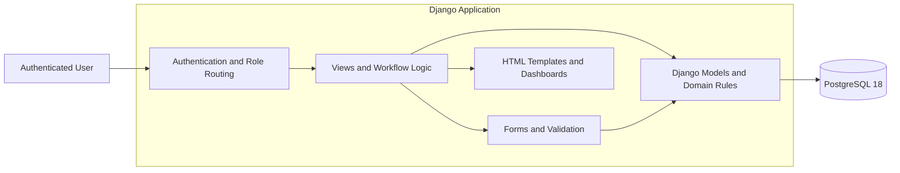
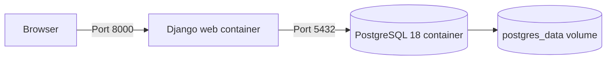

# ForgeOps MVP Architecture

## Overview

ForgeOps is an educational manufacturing operations platform built with Django and PostgreSQL.

The project models a lightweight manufacturing operations environment inspired by MES-style workflows.

ForgeOps is designed as a portfolio and learning project. It demonstrates manufacturing data modelling, operational workflows, role-based permissions, transactional traceability, automated testing, containerised development and continuous integration.

ForgeOps is not presented as a validated production MES and does not process real manufacturing data.

All test and demonstration data must remain synthetic.

## Technology Stack

The current ForgeOps MVP uses:

```text
Application framework: Django 6.0
Programming language: Python 3.12
Database: PostgreSQL 18
Frontend: Django templates, HTML and CSS
Authentication: Django authentication
Authorisation: Django Groups and server-side permission checks
Development containers: Docker and Docker Compose
Continuous integration: GitHub Actions
Source control: Git and GitHub
```

## High-Level Architecture



The application follows Django's standard server-rendered architecture.

Requests are authenticated and routed through Django views.

Server-side permission checks determine whether a user may perform protected actions.

Django models and database constraints protect core manufacturing data integrity.

PostgreSQL stores reference, operational and traceability records.

## Application Layers

### Presentation Layer

The presentation layer uses Django templates.

It provides:

- login
- role-specific dashboards
- Work Order pages
- Production Run pages
- Production Entry forms
- Downtime Event workflows
- Quality Inspection workflows
- AuditEvent history views

The user interface hides actions that are unavailable to a role where appropriate.

Hidden buttons are not treated as security controls.

Server-side permission checks remain authoritative.

### Application Layer

Django views and forms implement the website workflows.

The application layer is responsible for:

- authentication requirements
- role-based access control
- form processing
- workflow validation
- ProductionRun lifecycle transitions
- creation of operational records
- filtering and presentation of operational information
- dashboard summary queries

### Domain and Persistence Layer

Django models represent the manufacturing domain.

The implemented Core models are:

```text
Site
ProductionArea
ProductionLine
Product
Shift
DowntimeReason
WorkOrder
ProductionRun
ProductionEntry
DowntimeEvent
QualityInspection
AuditEvent
```

Django's User and Group models provide authentication identities and role membership.

PostgreSQL is the authoritative persistent datastore.

## Manufacturing Hierarchy

The physical manufacturing hierarchy is:

```text
Site
└── ProductionArea
    └── ProductionLine
```

A ProductionRun is assigned to a ProductionLine.

The ProductionLine therefore connects execution records to the manufacturing hierarchy.

## Planning and Execution Architecture

The central operational path is:

```text
Product
└── WorkOrder
    └── ProductionRun
```

A WorkOrder represents planned manufacturing demand for a Product.

A ProductionRun represents execution of that WorkOrder on a specific ProductionLine and Shift.

The ProductionRun lifecycle supports:

```text
PLANNED
ACTIVE
PAUSED
COMPLETED
CANCELLED
```

Lifecycle transitions are exposed through explicit website actions with server-side permission enforcement.

## Production Quantity Architecture

Production quantities are transactional.

ForgeOps does not store editable cumulative good and rejected quantities directly on ProductionRun.

Instead:

```text
ProductionRun
└── ProductionEntry
    ├── good_quantity
    ├── rejected_quantity
    ├── recorded_by
    └── recorded_at
```

ProductionRun totals are derived from related ProductionEntry records.

Derived values include:

```text
good quantity
rejected quantity
total recorded quantity
remaining quantity
completion percentage
rejection rate
```

ProductionEntry records may only be created against ACTIVE ProductionRuns.

## Downtime Architecture

Downtime is represented transactionally:

```text
ProductionRun
└── DowntimeEvent
    ├── DowntimeReason
    ├── started_at
    ├── ended_at
    ├── opened_by
    └── closed_by
```

An open DowntimeEvent has no end timestamp.

A closed DowntimeEvent has both:

```text
ended_at
closed_by
```

A ProductionRun may contain multiple historical DowntimeEvents.

Only one DowntimeEvent may remain open for a ProductionRun at a time.

Downtime duration is derived from the recorded timestamps.

Opening or closing downtime does not automatically pause or resume the associated ProductionRun.

## Quality Architecture

Quality checks are represented using QualityInspection:

```text
ProductionRun
└── QualityInspection
    ├── result
    ├── notes
    ├── completed_by
    └── completed_at
```

Supported results are:

```text
PENDING
PASSED
FAILED
```

A pending inspection has no completion User or completion timestamp.

A passed or failed inspection requires both.

Multiple QualityInspection records may belong to the same ProductionRun.

QualityInspection does not automatically change the ProductionRun state.

## Audit Architecture

AuditEvent provides a model for operational traceability records.

```text
AuditEvent
├── user
├── action_type
├── record_type
├── record_identifier
├── description
└── created_at
```

AuditEvent identifies the affected record using:

```text
record_type
record_identifier
```

rather than maintaining foreign keys to every possible ForgeOps model.

Existing AuditEvent records are exposed through controlled read-only behaviour.

Automatic AuditEvent generation for all WorkOrder, ProductionRun, ProductionEntry, DowntimeEvent and QualityInspection workflows is not currently implemented globally.

ForgeOps must therefore not be described as providing a complete automatic regulatory audit trail.

## Role-Based Access Architecture

ForgeOps uses Django Groups for application roles.

The current roles are:

```text
Operator
Production Supervisor
Quality Specialist
Manufacturing Engineer
Operations Manager
System Administrator
```

Django superusers retain administrative access independently of these application groups.

Role membership influences:

- dashboard routing
- page access
- workflow access
- lifecycle action permissions
- creation permissions
- operational visibility

Permission enforcement occurs on the server.

## Data Integrity

ForgeOps uses both Django validation and PostgreSQL constraints.

Examples include:

- globally unique Site codes
- ProductionArea codes unique within a Site
- ProductionLine codes unique within a ProductionArea
- globally unique Product codes
- globally unique WorkOrder numbers
- globally unique DowntimeReason codes
- positive WorkOrder planned quantity
- Shift start and end times must differ
- ProductionRun end time cannot precede start time
- maximum one ACTIVE ProductionRun per WorkOrder
- ProductionEntry quantities cannot be negative
- ProductionEntry must contain at least one unit
- ProductionEntry requires an ACTIVE ProductionRun
- maximum one open DowntimeEvent per ProductionRun
- DowntimeEvent end time cannot precede start time
- DowntimeEvent open and closed fields must remain consistent
- QualityInspection result and completion fields must remain consistent

Important historical relationships use `PROTECT` where deletion would damage operational traceability.

## Database Migrations

The current Core migration sequence is:

```text
0001_create_user_groups
0002_create_manufacturing_hierarchy
0003_create_operational_reference_models
0004_create_work_orders_production_runs
0005_create_production_entries
0006_downtimeevent
0007_qualityinspection
0008_auditevent
```

## Development Architecture

ForgeOps supports two development approaches.

### Host Development

```text
Django
    │
    ▼
PostgreSQL via Postgres.app
```

Private development configuration is supplied through `.env`.

### Docker Development



Docker Compose provides:

```text
web
db
```

The PostgreSQL service uses a health check before the Django service starts.

Docker database data persists through the named PostgreSQL volume.

## Continuous Integration Architecture

GitHub Actions provides automated verification.

The CI workflow runs on:

```text
push
pull_request
```

The CI environment uses:

```text
ubuntu-latest
Python 3.12
PostgreSQL 18
```

The workflow executes:

```bash
pip install -r requirements.txt
python manage.py migrate
python manage.py check
python manage.py makemigrations --check --dry-run
python manage.py test core -v 2
```

The verified FO-025 GitHub Actions regression result is:

```text
Ran 330 tests
OK
```

A failing required command causes the CI workflow to fail.

## Current MVP Boundary

ForgeOps currently demonstrates:

- manufacturing hierarchy modelling
- Product and WorkOrder planning
- ProductionRun execution
- lifecycle transitions
- production quantity recording
- downtime tracking
- quality inspection recording
- operational summary dashboards
- role-based access control
- AuditEvent storage and read-only website visibility
- PostgreSQL persistence
- Docker-based development
- automated regression testing
- GitHub Actions continuous integration

ForgeOps does not currently implement:

- automatic AuditEvent generation across all workflows
- machine connectivity
- OPC UA
- SAP integration
- external MES integration
- REST API functionality
- batch traceability
- deviation workflows
- CAPA workflows
- Redis or Celery
- Prometheus or Grafana
- advanced manufacturing analytics
- OEE calculations
- Kubernetes
- production-grade infrastructure

These behaviours remain reserved for future roadmap issues that explicitly define them.

All test and demonstration data must remain synthetic.