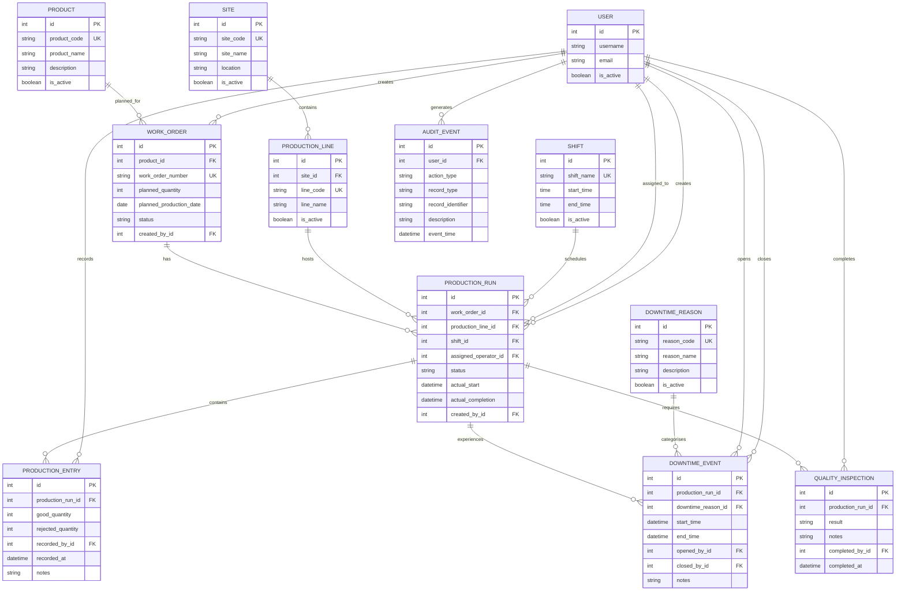

# ForgeOps MVP Entity-Relationship Diagram

This diagram represents the initial ForgeOps MVP database structure.

## Relationship Explanation

- One site contains many production lines.
- One product may have many work orders.
- One work order may have multiple production runs.
- One production line may host many production runs.
- One shift may be used by many production runs.
- One operator may be assigned to many runs over time, but only one may be active at a time.
- One production run may contain many production entries.
- One production run may experience many downtime events.
- One downtime reason may be used by many downtime events.
- One production run may have many quality inspections.
- One user may generate many audit events.

## Key

- `PK` means Primary Key.
- `FK` means Foreign Key.
- `UK` means Unique Key.
- `||` means exactly one.
- `o{` means zero or many.