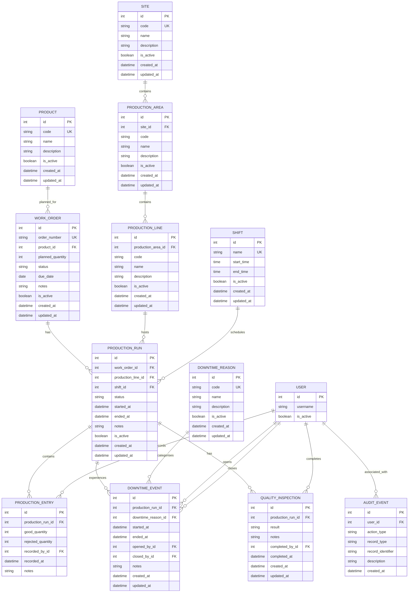

# ForgeOps MVP Entity-Relationship Diagram

## Purpose

This document represents the implemented ForgeOps MVP data model.

It is based on the current Django models rather than the earlier Phase 0 design.

The diagram focuses on the manufacturing-domain entities and their important relationships.

Django authentication users are represented as `USER`.

## Entity-Relationship Diagram



## Manufacturing Hierarchy

ForgeOps models the physical manufacturing hierarchy as:

```text
Site
└── ProductionArea
    └── ProductionLine
```

A Site may contain multiple ProductionAreas.

A ProductionArea belongs to one Site and may contain multiple ProductionLines.

A ProductionLine belongs to one ProductionArea.

## Planning and Execution Relationships

The primary planning and execution relationship is:

```text
Product
└── WorkOrder
    └── ProductionRun
```

A Product may have multiple WorkOrders.

Each WorkOrder belongs to one Product.

A WorkOrder may have multiple ProductionRuns over time.

Each ProductionRun belongs to:

```text
one WorkOrder
one ProductionLine
one Shift
```

## Production Entries

A ProductionRun may contain multiple ProductionEntry records.

Each ProductionEntry records:

```text
good quantity
rejected quantity
recording user
recording timestamp
optional notes
```

Production quantities are transactional rather than stored as editable cumulative fields on ProductionRun.

ProductionRun quantity totals are calculated from related ProductionEntry records.

## Downtime Events

A ProductionRun may contain multiple DowntimeEvents.

Each DowntimeEvent references:

```text
ProductionRun
DowntimeReason
opened_by User
closed_by User when closed
```

An open DowntimeEvent has:

```text
ended_at = null
closed_by = null
```

A closed DowntimeEvent requires both an end timestamp and closing User.

Only one DowntimeEvent may remain open for a ProductionRun at a time.

Opening or closing a DowntimeEvent does not automatically change the ProductionRun status.

## Quality Inspections

A ProductionRun may contain multiple QualityInspection records.

Supported inspection results are:

```text
PENDING
PASSED
FAILED
```

A pending inspection has no completion User or completion timestamp.

A passed or failed inspection requires both.

QualityInspection does not automatically change the associated ProductionRun state.

## Audit Events

AuditEvent stores traceability information using:

```text
user
action_type
record_type
record_identifier
description
created_at
```

AuditEvent does not contain a foreign key to every possible operational model.

The affected record is identified through:

```text
record_type
record_identifier
```

Automatic AuditEvent creation across all ForgeOps workflows is not currently implemented globally.

## Important Database Constraints

The implemented MVP includes important relational and integrity constraints.

### Manufacturing hierarchy

```text
Site.code
```

is globally unique.

A ProductionArea code is unique within its Site.

A ProductionLine code is unique within its ProductionArea.

### Reference data

The following are globally unique:

```text
Product.code
Shift.name
DowntimeReason.code
WorkOrder.order_number
```

### Work Orders

WorkOrder planned quantity must be greater than zero.

### Production Runs

A ProductionRun end timestamp cannot occur before its start timestamp.

Only one ProductionRun with status:

```text
ACTIVE
```

may exist for the same WorkOrder at a time.

### Production Entries

Good and rejected quantities cannot be negative.

A ProductionEntry must contain at least one good or rejected unit.

ProductionEntry creation requires an ACTIVE ProductionRun.

### Downtime Events

Downtime end time cannot occur before downtime start time.

Open and closed downtime fields must remain internally consistent.

Only one open DowntimeEvent may exist for a ProductionRun at a time.

### Quality Inspections

A `PENDING` inspection requires:

```text
completed_by = null
completed_at = null
```

A `PASSED` or `FAILED` inspection requires:

```text
completed_by
completed_at
```

## Protected Operational Relationships

Important ForgeOps relationships use protected deletion where removing referenced records would damage operational history.

Examples include relationships involving:

```text
WorkOrder
ProductionRun
ProductionEntry
DowntimeEvent
QualityInspection
AuditEvent
Product
ProductionLine
Shift
DowntimeReason
User
```

Reference data can generally be deactivated using `is_active` rather than deleting historical relationships.

## Key

```text
PK = Primary Key
FK = Foreign Key
UK = Unique Key
|| = exactly one
o{ = zero or many
```

## MVP Boundary

This ER diagram represents the implemented ForgeOps MVP.

It does not represent future roadmap concepts such as:

- batch traceability
- machine records
- SAP integration
- MES integration
- OPC UA
- deviation workflows
- CAPA workflows
- REST API resources
- advanced analytics models
- OEE models

These behaviours remain reserved for future roadmap issues that explicitly define them.

All test and demonstration data must remain synthetic.