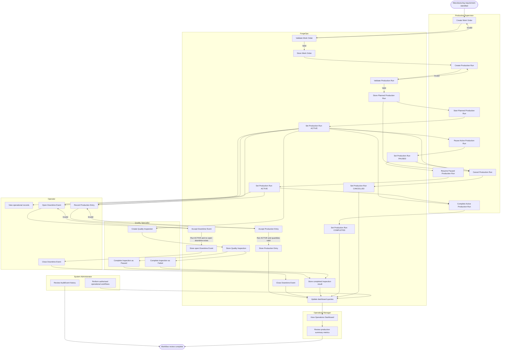

# ForgeOps MVP Production Workflow

## Purpose

This document describes the implemented ForgeOps MVP production workflow.

It reflects the current application behaviour rather than the earlier Phase 0 design.

The workflow focuses on the main website interactions between Production Supervisor, Operator, Quality Specialist, Operations Manager and System Administrator roles.

Automatic AuditEvent generation is not currently implemented globally and is therefore not shown as an automatic workflow step.

## Production Workflow



## Main Workflow Summary

The implemented MVP supports the following operational sequence:

1. A Production Supervisor creates a Work Order.
2. ForgeOps validates and stores the Work Order.
3. A Production Supervisor creates a Production Run for a Work Order.
4. The Production Run is assigned to a ProductionLine and Shift.
5. The Production Run begins in `PLANNED` status.
6. An authorised user starts the Production Run.
7. ForgeOps changes the Production Run to `ACTIVE`.
8. Production Entries may be recorded against the active run.
9. Downtime Events may be opened against the active run.
10. Open Downtime Events may later be closed.
11. Quality Inspections may be created for the Production Run.
12. Pending Quality Inspections may be completed as `PASSED` or `FAILED`.
13. An active Production Run may be paused.
14. A paused Production Run may be resumed.
15. An authorised active Production Run may be completed.
16. Eligible Production Runs may be cancelled.
17. Dashboard summaries reflect the stored operational data.

## Work Order Workflow

Work Orders represent manufacturing demand for a Product.

A Work Order contains:

```text
order number
product
planned quantity
status
due date
notes
```

Work Order creation is restricted to authorised roles.

The website validates required fields and model constraints before storing the record.

## Production Run Workflow

ProductionRun supports:

```text
PLANNED
ACTIVE
PAUSED
COMPLETED
CANCELLED
```

The website exposes explicit lifecycle actions.

### Start

```text
PLANNED -> ACTIVE
```

Starting a ProductionRun records `started_at`.

### Pause

```text
ACTIVE -> PAUSED
```

Pausing preserves the original `started_at`.

### Resume

```text
PAUSED -> ACTIVE
```

Resuming preserves the existing lifecycle timestamps.

### Complete

```text
ACTIVE -> COMPLETED
```

Completion records the end state according to the implemented completion workflow.

### Cancel

Eligible ProductionRuns may transition to:

```text
CANCELLED
```

The exact permitted source states are enforced by the application.

## Production Entry Workflow

ProductionEntry records transactional manufacturing output.

Each record contains:

```text
good_quantity
rejected_quantity
recorded_by
recorded_at
notes
```

A ProductionEntry must record at least one unit.

ProductionEntry creation requires the associated ProductionRun to be:

```text
ACTIVE
```

ProductionRun output totals are derived from related ProductionEntry records.

## Downtime Workflow

Downtime is represented using DowntimeEvent.

An event records:

```text
ProductionRun
DowntimeReason
started_at
ended_at
opened_by
closed_by
notes
```

Downtime may only be opened against an `ACTIVE` ProductionRun.

Only one DowntimeEvent may remain open for the same ProductionRun.

Closing downtime records:

```text
ended_at
closed_by
```

Opening downtime does not automatically pause the ProductionRun.

Closing downtime does not automatically resume the ProductionRun.

ProductionRun lifecycle actions remain separate explicit workflows.

## Quality Inspection Workflow

QualityInspection supports:

```text
PENDING
PASSED
FAILED
```

An inspection is created in the pending state.

A permitted Quality Specialist or System Administrator may later complete it.

A completed inspection records:

```text
result
completed_by
completed_at
notes
```

A failed inspection does not automatically move the ProductionRun to another lifecycle state.

QualityInspection and ProductionRun lifecycle behaviour remain separate workflows.

## Dashboard Behaviour

Role dashboards display summary information derived from existing ForgeOps operational records.

Examples include:

```text
active ProductionRuns
good units recorded
open DowntimeEvents
failed QualityInspections
```

Dashboard values are calculated from persisted application data.

No separate analytics database is used in the MVP.

## AuditEvent Behaviour

AuditEvent exists as an operational traceability model and has controlled read-only website visibility.

The current MVP does not automatically generate AuditEvent records for every operational action.

The workflow therefore does not claim automatic audit logging for:

```text
Work Order creation
Production Run lifecycle actions
Production Entry creation
Downtime Event actions
Quality Inspection actions
configuration changes
```

Automatic AuditEvent generation remains reserved for a future roadmap issue.

## Role Responsibilities

### Operator

The Operator role is intended for operational data-entry workflows.

Implemented Operator access includes permitted production-related views and actions such as ProductionEntry and DowntimeEvent workflows where authorised.

### Production Supervisor

The Production Supervisor role manages planning and ProductionRun lifecycle workflows.

This includes permitted Work Order creation, ProductionRun creation and lifecycle actions.

### Quality Specialist

The Quality Specialist role manages QualityInspection creation and completion workflows.

### Manufacturing Engineer

The Manufacturing Engineer role has its own role-based dashboard and operational visibility according to the implemented permission model.

### Operations Manager

The Operations Manager role provides management-level dashboard visibility.

### System Administrator

The System Administrator role has broad application-level operational access.

System Administrator permissions are explicitly tested across critical workflows.

## System Integrity Rules

Important workflow rules include:

- ProductionEntry creation requires an ACTIVE ProductionRun
- a ProductionEntry must contain at least one good or rejected unit
- no ProductionRun end timestamp may precede its start timestamp
- only one ACTIVE ProductionRun may exist for a WorkOrder at a time
- DowntimeEvent creation requires an ACTIVE ProductionRun
- only one open DowntimeEvent may exist for a ProductionRun
- downtime end time cannot precede downtime start time
- downtime closure requires a closing User
- pending QualityInspections cannot contain completion metadata
- passed and failed QualityInspections require completion metadata
- protected relationships preserve important historical records

## Demonstration Sequence

A portfolio demonstration can show the following implemented workflow:

1. Sign in as a Production Supervisor.
2. Create a Work Order.
3. Create a Production Run.
4. Start the Production Run.
5. Record ProductionEntry output using an authorised role.
6. Open and close a DowntimeEvent.
7. Create a QualityInspection.
8. Complete the QualityInspection as passed.
9. Return to an authorised lifecycle role.
10. Complete the ProductionRun.
11. View updated dashboard information.
12. Review AuditEvent history where authorised.
13. Show the passing GitHub Actions CI workflow.

The demonstration must use synthetic data only.

## MVP Boundary

The workflow does not implement or imply:

- automatic audit logging across all workflows
- automatic ProductionRun pause when downtime opens
- automatic ProductionRun resume when downtime closes
- automatic ProductionRun state changes from QualityInspection results
- automatic failed-inspection rework loops
- machine control
- machine connectivity
- OPC UA integration
- SAP integration
- MES integration
- OEE calculations
- batch traceability
- deviation workflows
- CAPA workflows
- automatic scheduling
- background job processing
- advanced analytics

These behaviours remain reserved for future roadmap issues that explicitly define them.

All test and demonstration data must remain synthetic.