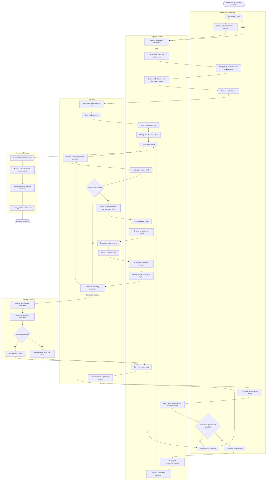

# ForgeOps MVP Production Workflow

## Purpose

This workflow describes the main ForgeOps production process from work-order creation to management reporting.

It is a BPMN-style workflow represented using Mermaid. Each section represents a user role or the ForgeOps system.

## Main Workflow Summary

1. The supervisor creates a work order.
2. ForgeOps validates and stores the work order.
3. The supervisor assigns the production line, shift and operator.
4. The operator starts the production run.
5. ForgeOps records the start time and changes the run status to Active.
6. The operator records good and rejected quantities.
7. If production stops, the operator opens a downtime event.
8. ForgeOps pauses the production run and records the downtime.
9. The operator closes the downtime event when the issue is resolved.
10. A quality specialist performs the final inspection.
11. A failed inspection returns the run for correction.
12. A passed inspection allows the supervisor to review completion requirements.
13. The supervisor completes the production run.
14. ForgeOps locks the completed records and updates the dashboard.
15. The operations manager reviews production performance.

## Completion Requirements

A production run can only be completed when:

- The production run is active or awaiting review.
- No downtime event remains open.
- At least one final inspection has passed.
- Production quantities have been recorded.
- The supervisor has permission to complete the run.

## Audit Events

ForgeOps records audit events when:

- A work order is created.
- A production run is assigned.
- A production run is started.
- Production output is recorded.
- Downtime is opened or closed.
- An inspection result is recorded.
- A production run is completed.